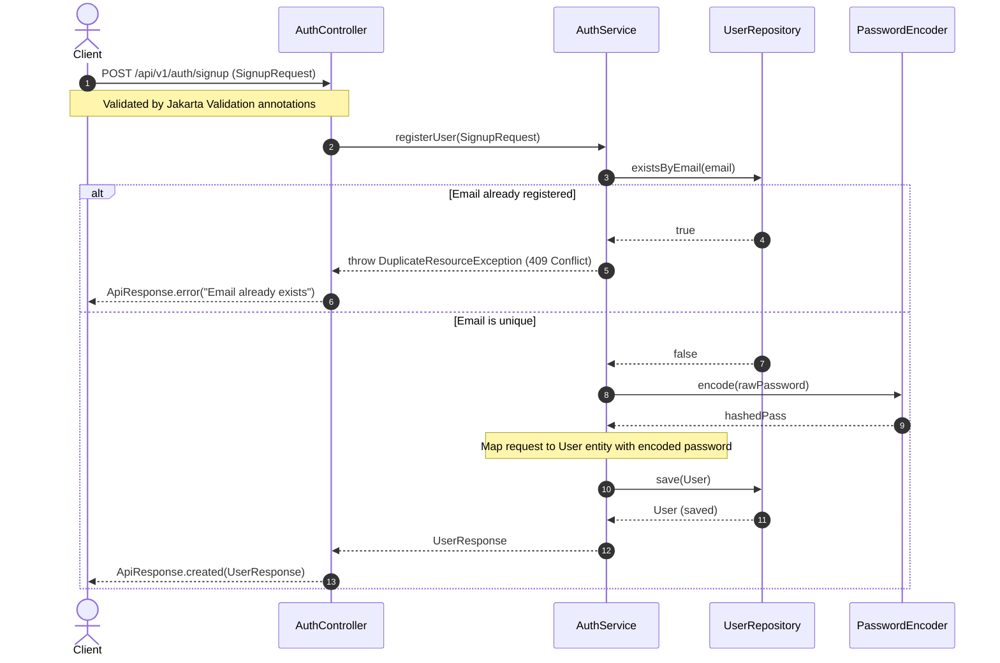
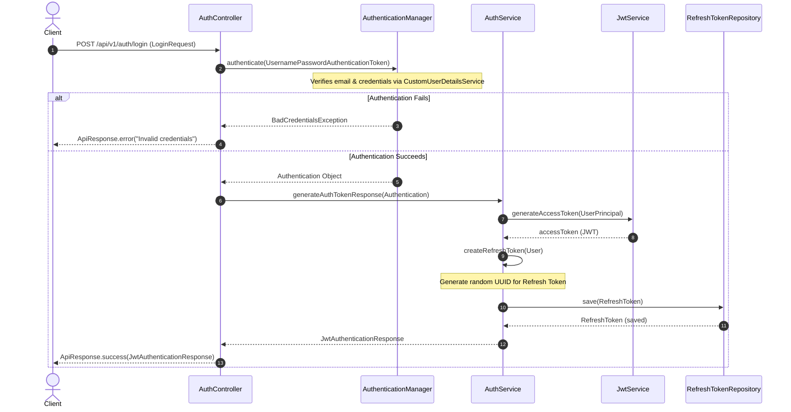
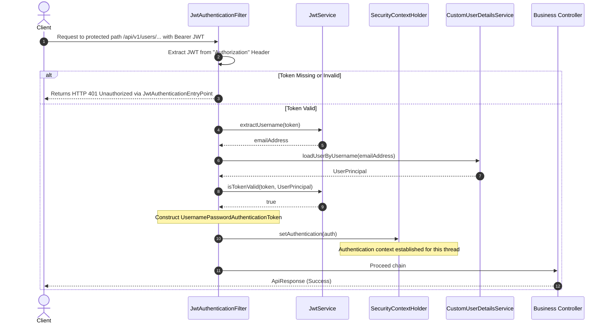
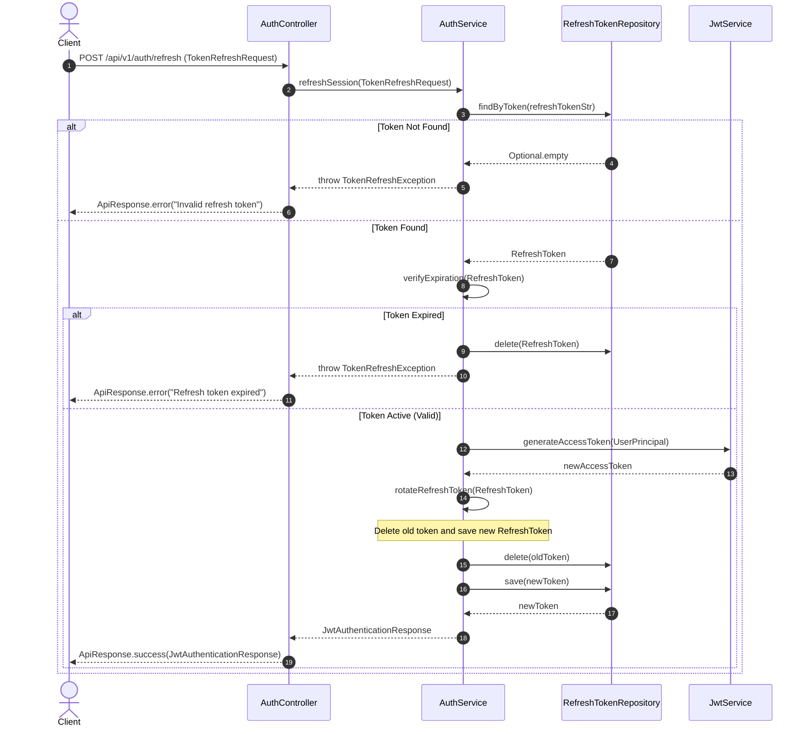

# LMS Authentication & Authorization Flow

This document details the architectural design and sequence flows for the authentication and authorization processes in the AI-Powered Learning Management System (LMS).

---

## 1. User Registration / Sign Up Flow

The Sign Up flow registers a new user with standard credentials. The password is hashed using **BCrypt** before database persistence.

---

## 2. User Log In / Authentication Flow

Authentication verifies the user's password and returns a stateless access token alongside a stateful refresh token.

---

## 3. Stateless Request Authentication Filter

For protected API resources, the incoming request intercepts a filter that authenticates the user by inspecting the access token.

---

## 4. Refresh Token Rotation Flow

Allows the client to obtain a fresh access token without re-entering credentials. Implements token rotation by generating a new refresh token and deleting the old one.

