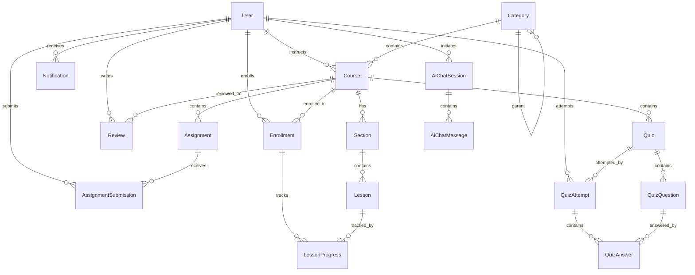

# AI-Powered LMS — Project Constitution

> **This document is the permanent rulebook for the project.**
> Every developer must read and follow this before writing any code.
> Changes to this document require team consensus.

---

## Table of Contents

1. [Project Overview](#1-project-overview)
2. [Architecture](#2-architecture)
3. [Technology Stack](#3-technology-stack)
4. [Package Structure](#4-package-structure)
5. [Development Philosophy](#5-development-philosophy)
6. [Coding Standards](#6-coding-standards)
7. [Naming Conventions](#7-naming-conventions)
8. [Entity Design](#8-entity-design)
9. [Database Design](#9-database-design)
10. [API Conventions](#10-api-conventions)
11. [DTO Strategy](#11-dto-strategy)
12. [Mapper Strategy](#12-mapper-strategy)
13. [Exception Handling Strategy](#13-exception-handling-strategy)
14. [Validation Strategy](#14-validation-strategy)
15. [Logging Strategy](#15-logging-strategy)
16. [Configuration Strategy](#16-configuration-strategy)
17. [Security Strategy](#17-security-strategy)
18. [Testing Strategy](#18-testing-strategy)
19. [AI Integration Strategy](#19-ai-integration-strategy)
20. [Deployment Strategy](#20-deployment-strategy)
21. [Branch Strategy](#21-branch-strategy)
22. [Commit Message Convention](#22-commit-message-convention)
23. [Definition of Done](#23-definition-of-done)
24. [Future: Microservice Migration](#24-future-microservice-migration)

---

## 1. Project Overview

**Name**: AI-Powered Learning Management System (LMS)

**Domain**: Online education platform with AI capabilities — comparable to Coursera/Udemy with AI Tutor features.

**Core Capabilities**:
- User management and authentication
- Course, lesson, and section management
- Student enrollment and progress tracking
- Assignments and quizzes with auto-grading
- AI-powered tutoring, quiz generation, and course recommendations
- Document-based Q&A via RAG (Retrieval-Augmented Generation)
- Real-time notifications
- File upload and management

**Target Audience**: Students, instructors, and administrators.

---

## 2. Architecture

### 2.1 Architectural Style

**Monolith-first** with feature-based modular packaging.

The application is a single deployable Spring Boot JAR. Internally, it is organized into self-contained feature modules that mirror future microservice boundaries. This gives us:

- Simple deployment and debugging during development
- Clear module boundaries for future extraction
- No distributed system complexity until it's needed

### 2.2 Layered Architecture (within each module)

```
┌─────────────────────────────────┐
│         Controller Layer        │  ← HTTP concerns only
├─────────────────────────────────┤
│          Service Layer          │  ← Business logic
├─────────────────────────────────┤
│        Repository Layer         │  ← Data access only
├─────────────────────────────────┤
│          Entity Layer           │  ← Database model
└─────────────────────────────────┘
```

**Rules**:
- Controllers handle HTTP request/response mapping, validation triggering, and delegation to services. No business logic.
- Services contain all business logic, transaction management, and cross-entity orchestration.
- Repositories contain only persistence queries. No business logic.
- Entities represent the database model. No presentation or business logic.

### 2.3 Cross-Module Communication

Within the monolith, modules communicate by injecting each other's **service interfaces**. For example, `EnrollmentServiceImpl` may inject `CourseService` and `UserService`.

**Rules**:
- Never inject a repository from another module. Always go through the service.
- Never directly access another module's entities in your controller — use DTOs.

### 2.4 High-Level Module Map

```
┌───────────────────────────────────────────────────────────┐
│                    API Gateway (future)                     │
└──────────────────────┬────────────────────────────────────┘
                       │
┌──────────────────────▼────────────────────────────────────┐
│                  Spring Boot Application                   │
│                                                            │
│  ┌──────────┐ ┌──────────┐ ┌──────────┐ ┌──────────┐     │
│  │   user   │ │  course  │ │  lesson  │ │enrollment│     │
│  └──────────┘ └──────────┘ └──────────┘ └──────────┘     │
│  ┌──────────┐ ┌──────────┐ ┌──────────┐ ┌──────────┐     │
│  │assignment│ │   quiz   │ │  review  │ │notification│   │
│  └──────────┘ └──────────┘ └──────────┘ └──────────┘     │
│  ┌──────────┐ ┌──────────┐ ┌──────────┐                   │
│  │    ai    │ │ storage  │ │ security │                   │
│  └──────────┘ └──────────┘ └──────────┘                   │
│  ┌──────────┐ ┌──────────┐ ┌──────────┐                   │
│  │  common  │ │  config  │ │exception │                   │
│  └──────────┘ └──────────┘ └──────────┘                   │
│                                                            │
│  ┌────────────────────────────────────────────────────┐   │
│  │              PostgreSQL + Redis                     │   │
│  └────────────────────────────────────────────────────┘   │
└───────────────────────────────────────────────────────────┘
```

---

## 3. Technology Stack

| Category | Technology | Version | Purpose |
|---|---|---|---|
| Language | Java | 21 | LTS, virtual threads, records, pattern matching |
| Framework | Spring Boot | 3.3.x | Application framework |
| Build | Maven | 3.9+ | Dependency and build management |
| Database | PostgreSQL | 16+ | Primary relational database |
| ORM | Spring Data JPA + Hibernate | 6.x | Data access and ORM |
| Security | Spring Security | 6.x | Authentication and authorization |
| Auth Tokens | JJWT (io.jsonwebtoken) | 0.12.x | JWT generation and validation |
| Validation | Jakarta Bean Validation | 3.x | Request validation |
| Mapping | MapStruct | 1.5.x | Compile-time DTO mapping |
| Boilerplate | Lombok | Latest | Reduce boilerplate code |
| API Docs | SpringDoc OpenAPI | 2.x | Swagger UI and API documentation |
| Caching | Redis + Spring Data Redis | — | Distributed caching |
| Real-Time | Spring WebSocket (STOMP) | — | Real-time notifications |
| AI | Spring AI | 1.0.x | LLM integration (OpenAI, Gemini) |
| Logging | SLF4J + Logback | — | Structured logging |
| Testing | JUnit 5 + Mockito + Testcontainers | — | Unit and integration testing |
| Containerization | Docker + Docker Compose | — | Deployment |
| Migration | Flyway | 10.x | Database migrations (Sprint 20) |

---

## 4. Package Structure

```
com.abhinav.lms
│
├── LmsApplication.java                          # Application entry point
│
├── common/                                       # Shared infrastructure
│   ├── entity/
│   │   └── BaseEntity.java                       # UUID, audit fields
│   ├── dto/
│   │   ├── ApiResponse.java                      # Generic response wrapper
│   │   └── PagedResponse.java                    # Pagination wrapper
│   └── constants/
│       └── AppConstants.java                     # Global constants
│
├── config/                                       # Application-wide configuration
│   ├── JpaConfig.java                            # JPA auditing
│   ├── OpenApiConfig.java                        # Swagger / OpenAPI
│   ├── WebConfig.java                            # CORS, WebMvc
│   ├── RedisConfig.java                          # Redis (Sprint 13)
│   ├── WebSocketConfig.java                      # WebSocket STOMP (Sprint 12)
│   └── AiConfig.java                            # Spring AI providers (Sprint 14)
│
├── exception/                                    # Global exception handling
│   ├── GlobalExceptionHandler.java
│   ├── ResourceNotFoundException.java
│   ├── DuplicateResourceException.java
│   ├── BadRequestException.java
│   └── BusinessException.java
│
├── security/                                     # Auth & security (Sprint 3)
│   ├── SecurityConfig.java
│   ├── JwtTokenProvider.java
│   ├── JwtAuthenticationFilter.java
│   ├── CustomUserDetailsService.java
│   ├── CurrentUser.java                          # Custom annotation
│   ├── controller/
│   │   └── AuthController.java
│   └── dto/
│       ├── LoginRequest.java
│       ├── SignupRequest.java
│       └── AuthResponse.java
│
├── user/                                         # User management
│   ├── controller/
│   │   └── UserController.java
│   ├── dto/
│   │   ├── CreateUserRequest.java
│   │   ├── UpdateUserRequest.java
│   │   ├── UserResponse.java
│   │   └── UserSummaryResponse.java
│   ├── entity/
│   │   ├── User.java
│   │   └── UserRole.java
│   ├── mapper/
│   │   └── UserMapper.java
│   ├── repository/
│   │   └── UserRepository.java
│   └── service/
│       ├── UserService.java                      # Interface
│       └── UserServiceImpl.java                  # Implementation
│
├── course/                                       # Course management (Sprint 4)
│   ├── controller/
│   │   ├── CourseController.java
│   │   ├── CategoryController.java
│   │   └── SectionController.java
│   ├── dto/
│   │   ├── CreateCourseRequest.java
│   │   ├── UpdateCourseRequest.java
│   │   ├── CourseResponse.java
│   │   ├── CourseSummaryResponse.java
│   │   ├── CourseSearchRequest.java
│   │   ├── CreateCategoryRequest.java
│   │   ├── CategoryResponse.java
│   │   ├── CreateSectionRequest.java
│   │   └── SectionResponse.java
│   ├── entity/
│   │   ├── Course.java
│   │   ├── CourseStatus.java
│   │   ├── DifficultyLevel.java
│   │   ├── Category.java
│   │   └── Section.java
│   ├── mapper/
│   │   ├── CourseMapper.java
│   │   ├── CategoryMapper.java
│   │   └── SectionMapper.java
│   ├── repository/
│   │   ├── CourseRepository.java
│   │   ├── CategoryRepository.java
│   │   └── SectionRepository.java
│   └── service/
│       ├── CourseService.java
│       ├── CourseServiceImpl.java
│       ├── CategoryService.java
│       ├── CategoryServiceImpl.java
│       ├── SectionService.java
│       └── SectionServiceImpl.java
│
├── lesson/                                       # Lesson management (Sprint 5)
│   ├── controller/
│   │   └── LessonController.java
│   ├── dto/
│   │   ├── CreateLessonRequest.java
│   │   ├── UpdateLessonRequest.java
│   │   └── LessonResponse.java
│   ├── entity/
│   │   ├── Lesson.java
│   │   └── ContentType.java
│   ├── mapper/
│   │   └── LessonMapper.java
│   ├── repository/
│   │   └── LessonRepository.java
│   └── service/
│       ├── LessonService.java
│       └── LessonServiceImpl.java
│
├── enrollment/                                   # Enrollment & progress (Sprint 6-7)
│   ├── controller/
│   │   ├── EnrollmentController.java
│   │   └── ProgressController.java
│   ├── dto/
│   │   ├── EnrollmentResponse.java
│   │   ├── ProgressResponse.java
│   │   └── LessonProgressResponse.java
│   ├── entity/
│   │   ├── Enrollment.java
│   │   ├── EnrollmentStatus.java
│   │   └── LessonProgress.java
│   ├── mapper/
│   │   └── EnrollmentMapper.java
│   ├── repository/
│   │   ├── EnrollmentRepository.java
│   │   └── LessonProgressRepository.java
│   └── service/
│       ├── EnrollmentService.java
│       ├── EnrollmentServiceImpl.java
│       ├── ProgressService.java
│       └── ProgressServiceImpl.java
│
├── assignment/                                   # Assignments (Sprint 8)
│   ├── controller/
│   │   ├── AssignmentController.java
│   │   └── SubmissionController.java
│   ├── dto/
│   │   ├── CreateAssignmentRequest.java
│   │   ├── UpdateAssignmentRequest.java
│   │   ├── AssignmentResponse.java
│   │   ├── SubmitAssignmentRequest.java
│   │   ├── GradeSubmissionRequest.java
│   │   └── SubmissionResponse.java
│   ├── entity/
│   │   ├── Assignment.java
│   │   ├── AssignmentSubmission.java
│   │   └── SubmissionStatus.java
│   ├── mapper/
│   │   ├── AssignmentMapper.java
│   │   └── SubmissionMapper.java
│   ├── repository/
│   │   ├── AssignmentRepository.java
│   │   └── AssignmentSubmissionRepository.java
│   └── service/
│       ├── AssignmentService.java
│       ├── AssignmentServiceImpl.java
│       ├── SubmissionService.java
│       └── SubmissionServiceImpl.java
│
├── quiz/                                         # Quizzes (Sprint 9)
│   ├── controller/
│   │   ├── QuizController.java
│   │   └── QuizAttemptController.java
│   ├── dto/
│   │   ├── CreateQuizRequest.java
│   │   ├── UpdateQuizRequest.java
│   │   ├── QuizResponse.java
│   │   ├── CreateQuestionRequest.java
│   │   ├── QuestionResponse.java
│   │   ├── StartAttemptResponse.java
│   │   ├── SubmitAnswerRequest.java
│   │   ├── SubmitQuizRequest.java
│   │   └── AttemptResultResponse.java
│   ├── entity/
│   │   ├── Quiz.java
│   │   ├── QuizQuestion.java
│   │   ├── QuestionType.java
│   │   ├── QuizAttempt.java
│   │   └── QuizAnswer.java
│   ├── mapper/
│   │   ├── QuizMapper.java
│   │   └── QuizAttemptMapper.java
│   ├── repository/
│   │   ├── QuizRepository.java
│   │   ├── QuizQuestionRepository.java
│   │   ├── QuizAttemptRepository.java
│   │   └── QuizAnswerRepository.java
│   └── service/
│       ├── QuizService.java
│       ├── QuizServiceImpl.java
│       ├── QuizAttemptService.java
│       └── QuizAttemptServiceImpl.java
│
├── review/                                       # Course reviews (Sprint 10)
│   ├── controller/
│   │   └── ReviewController.java
│   ├── dto/
│   │   ├── CreateReviewRequest.java
│   │   ├── UpdateReviewRequest.java
│   │   └── ReviewResponse.java
│   ├── entity/
│   │   └── Review.java
│   ├── mapper/
│   │   └── ReviewMapper.java
│   ├── repository/
│   │   └── ReviewRepository.java
│   └── service/
│       ├── ReviewService.java
│       └── ReviewServiceImpl.java
│
├── storage/                                      # File storage (Sprint 11)
│   ├── controller/
│   │   └── FileController.java
│   ├── dto/
│   │   └── FileUploadResponse.java
│   └── service/
│       ├── StorageService.java                   # Interface (multiple impls possible)
│       └── LocalStorageService.java
│
├── notification/                                 # Notifications (Sprint 12)
│   ├── controller/
│   │   └── NotificationController.java
│   ├── dto/
│   │   └── NotificationResponse.java
│   ├── entity/
│   │   ├── Notification.java
│   │   └── NotificationType.java
│   ├── repository/
│   │   └── NotificationRepository.java
│   └── service/
│       ├── NotificationService.java
│       ├── NotificationServiceImpl.java
│       └── WebSocketNotificationService.java
│
└── ai/                                           # AI features (Sprint 14-17)
    ├── controller/
    │   ├── AiTutorController.java
    │   ├── QuizGenerationController.java
    │   ├── RecommendationController.java
    │   └── RagController.java
    ├── dto/
    │   ├── ChatRequest.java
    │   ├── ChatResponse.java
    │   ├── GenerateQuizRequest.java
    │   ├── GeneratedQuizResponse.java
    │   ├── RecommendationResponse.java
    │   ├── RagQueryRequest.java
    │   └── RagQueryResponse.java
    ├── entity/
    │   ├── AiChatSession.java
    │   ├── AiChatMessage.java
    │   └── Document.java
    ├── mapper/
    │   └── AiChatMapper.java
    ├── repository/
    │   ├── AiChatSessionRepository.java
    │   ├── AiChatMessageRepository.java
    │   └── DocumentRepository.java
    └── service/
        ├── AiTutorService.java
        ├── AiTutorServiceImpl.java
        ├── QuizGenerationService.java
        ├── QuizGenerationServiceImpl.java
        ├── RecommendationService.java
        ├── RecommendationServiceImpl.java
        ├── RagService.java
        ├── RagServiceImpl.java
        └── DocumentService.java
```

### 4.1 Package Rules

| Rule | Description |
|---|---|
| **Self-contained modules** | Each feature package contains its own controller, dto, entity, mapper, repository, and service sub-packages. |
| **No cross-module repository access** | Module A must not inject Module B's repository. Use Module B's service instead. |
| **Shared code in `common`** | BaseEntity, ApiResponse, PagedResponse, constants go in `common`. |
| **Config in `config`** | Application-wide beans (JPA, CORS, Redis, WebSocket, AI) go in `config`. |
| **Security is cross-cutting** | Security config, JWT, auth controller live in `security`. |
| **Exception handling is cross-cutting** | GlobalExceptionHandler and custom exceptions live in `exception`. |
| **No utility grab-bag** | Do not create a generic `util` package. If a utility is module-specific, put it in that module. If it's truly shared, put it in `common`. Only create it when genuinely needed. |

---

## 5. Development Philosophy

### Core Principles

| Principle | Meaning |
|---|---|
| **YAGNI** | Do not build it until you need it. No speculative abstractions. |
| **SOLID** | Single Responsibility, Open/Closed, Liskov Substitution, Interface Segregation, Dependency Inversion. |
| **Clean Code** | Readable code is maintainable code. If it needs a comment explaining *what* it does, refactor it. |
| **DRY** | Don't Repeat Yourself — but don't over-abstract either. Duplication is better than the wrong abstraction. |
| **Convention over Configuration** | Follow Spring Boot conventions. Don't fight the framework. |
| **Explicit over Implicit** | Prefer constructor injection over field injection. Prefer explicit mapping over reflection magic. |

### Anti-Patterns to Avoid

- ❌ God classes (>300 lines suggests a split is needed)
- ❌ Anemic domain model masquerading as "clean" (entities with only getters/setters and all logic in services is fine for this project, but services must not become God classes)
- ❌ Premature abstraction (don't create interfaces for classes that will only ever have one implementation — *except* services, where the interface pattern is a project convention)
- ❌ Catch-all utility classes (`StringUtils`, `CommonHelper`, `MiscUtil`)
- ❌ Business logic in controllers or repositories
- ❌ Returning entities from controllers
- ❌ Swallowing exceptions silently

---

## 6. Coding Standards

### 6.1 General

```java
// ✅ Constructor injection via Lombok
@Service
@RequiredArgsConstructor
@Slf4j
public class UserServiceImpl implements UserService {

    private final UserRepository userRepository;
    private final UserMapper userMapper;

    @Override
    @Transactional(readOnly = true)
    public UserResponse getUserById(UUID id) {
        User user = userRepository.findById(id)
                .orElseThrow(() -> new ResourceNotFoundException("User", "id", id));
        return userMapper.toResponse(user);
    }
}
```

### 6.2 Rules

| Rule | Standard |
|---|---|
| **Injection** | Constructor injection only. Use `@RequiredArgsConstructor`. |
| **Transactions** | `@Transactional` on service methods. Use `readOnly = true` for queries. |
| **Logging** | Use `@Slf4j` (Lombok). Never `System.out.println`. |
| **Access modifiers** | Package-private by default for internal classes. `public` only for API surfaces (controllers, service interfaces, DTOs). |
| **Final fields** | All injected dependencies are `private final`. |
| **Optional handling** | Never return `null` from repositories — use `Optional` and `.orElseThrow()`. |
| **Collections** | Return empty collections, never `null`. |
| **String comparison** | Use `"constant".equals(variable)` to avoid NPE. |
| **Formatting** | 4-space indent, 120-char line width, blank line between methods. |
| **Imports** | No wildcard imports. IDE auto-organize. |

### 6.3 Controller Standards

```java
@RestController
@RequestMapping(AppConstants.API_V1 + "/users")
@RequiredArgsConstructor
@Tag(name = "User Management")
public class UserController {

    private final UserService userService;

    @PostMapping
    @ResponseStatus(HttpStatus.CREATED)
    @Operation(summary = "Create a new user")
    public ApiResponse<UserResponse> createUser(
            @Valid @RequestBody CreateUserRequest request) {
        UserResponse user = userService.createUser(request);
        return ApiResponse.created(user, "User created successfully");
    }
}
```

**Controller rules**:
- Always use `@Valid` on request bodies
- Always use appropriate `@ResponseStatus`
- Always add OpenAPI annotations (`@Tag`, `@Operation`)
- Return `ApiResponse<T>` from all endpoints
- No business logic — delegate everything to service

---

## 7. Naming Conventions

| Element | Convention | Example |
|---|---|---|
| Package | lowercase, singular nouns | `com.abhinav.lms.user` |
| Class | PascalCase | `UserServiceImpl` |
| Interface | PascalCase, no I-prefix | `UserService` |
| Method | camelCase, verb-first | `getUserById`, `createUser` |
| Variable | camelCase | `enrollmentCount` |
| Constant | UPPER_SNAKE_CASE | `DEFAULT_PAGE_SIZE` |
| Enum | PascalCase class, UPPER_SNAKE values | `UserRole.STUDENT` |
| Entity | Singular noun | `User`, `Course`, `Quiz` |
| Table | snake_case, plural | `users`, `courses`, `quiz_attempts` |
| Column | snake_case | `first_name`, `created_at` |
| DTO (create) | `Create{Entity}Request` | `CreateUserRequest` |
| DTO (update) | `Update{Entity}Request` | `UpdateUserRequest` |
| DTO (response) | `{Entity}Response` | `UserResponse` |
| DTO (summary) | `{Entity}SummaryResponse` | `CourseSummaryResponse` |
| Controller | `{Entity}Controller` | `UserController` |
| Service interface | `{Entity}Service` | `UserService` |
| Service impl | `{Entity}ServiceImpl` | `UserServiceImpl` |
| Repository | `{Entity}Repository` | `UserRepository` |
| Mapper | `{Entity}Mapper` | `UserMapper` |
| Exception | `{Condition}Exception` | `ResourceNotFoundException` |
| Test | `{Class}Test` | `UserServiceImplTest` |
| Integration Test | `{Class}IntegrationTest` | `UserControllerIntegrationTest` |
| API path | `/api/v1/{plural-resource}` | `/api/v1/courses` |

---

## 8. Entity Design

### 8.1 BaseEntity

Every domain entity extends `BaseEntity`:

```java
@MappedSuperclass
@EntityListeners(AuditingEntityListener.class)
@Getter
public abstract class BaseEntity {

    @Id
    @GeneratedValue(strategy = GenerationType.UUID)
    @Column(updatable = false, nullable = false)
    private UUID id;

    @CreatedDate
    @Column(nullable = false, updatable = false)
    private LocalDateTime createdAt;

    @LastModifiedDate
    @Column(nullable = false)
    private LocalDateTime updatedAt;

    @CreatedBy
    @Column(updatable = false)
    private String createdBy;

    @LastModifiedBy
    private String updatedBy;
}
```

### 8.2 Entity Rules

| Rule | Description |
|---|---|
| Extend `BaseEntity` | Every domain entity extends it — gets UUID PK + audit fields for free. |
| `@Table(name = "...")` | Always specify explicit table name (plural, snake_case). |
| `@Column` annotations | Use for non-null constraints, length limits, unique constraints. |
| Relationships | Use `@ManyToOne` with `fetch = FetchType.LAZY` by default. |
| No `@Data` on entities | Use `@Getter`, `@Setter`, `@NoArgsConstructor`, `@AllArgsConstructor`, `@Builder` separately. Never `@Data` — it generates `equals`/`hashCode` using all fields including lazy proxies. |
| `equals`/`hashCode` | Override based on `id` field only (or use `@EqualsAndHashCode(onlyExplicitlyIncluded = true)` with `@Include` on `id`). |
| Cascade | Use `CascadeType.ALL` + `orphanRemoval = true` only for true parent-child (Course → Sections). Never cascade across aggregate boundaries. |
| Indexes | Add `@Table(indexes = ...)` for frequently queried columns. |

---

## 9. Database Design

### 9.1 Connection Details

| Field | Value |
|---|---|
| Database | PostgreSQL 16+ |
| DB Name | `lms_db` |
| Username | `lms_user` |
| Password | `lms_password_123` |
| Host | `localhost` |
| Port | `5432` |

### 9.2 Entity Relationship Diagram



### 9.3 Table Overview

| Table | Module | Key Columns (beyond BaseEntity) |
|---|---|---|
| `users` | user | first_name, last_name, email (unique), password, role, profile_image_url, bio, phone_number, enabled, email_verified |
| `categories` | course | name, description, slug (unique), parent_id (self-ref FK) |
| `courses` | course | title, description, short_description, thumbnail_url, price, status, difficulty, language, estimated_duration, instructor_id (FK → users), category_id (FK → categories) |
| `sections` | course | title, sort_order, course_id (FK → courses) |
| `lessons` | lesson | title, content, video_url, resource_url, duration, sort_order, content_type, published, section_id (FK → sections) |
| `enrollments` | enrollment | student_id (FK → users), course_id (FK → courses), enrolled_at, completed_at, status, progress. Unique(student_id, course_id) |
| `lesson_progress` | enrollment | enrollment_id (FK → enrollments), lesson_id (FK → lessons), completed, completed_at. Unique(enrollment_id, lesson_id) |
| `assignments` | assignment | title, description, instructions, max_score, due_date, course_id (FK → courses), lesson_id (FK nullable → lessons) |
| `assignment_submissions` | assignment | assignment_id (FK), student_id (FK → users), content, file_url, submitted_at, grade, feedback, graded_at, graded_by (FK → users), status |
| `quizzes` | quiz | title, description, time_limit, passing_score, max_attempts, shuffle_questions, course_id (FK), lesson_id (FK nullable) |
| `quiz_questions` | quiz | quiz_id (FK), question_text, question_type, options (JSONB), correct_answer, explanation, points, sort_order |
| `quiz_attempts` | quiz | quiz_id (FK), student_id (FK → users), started_at, completed_at, score, total_points, passed, attempt_number |
| `quiz_answers` | quiz | attempt_id (FK), question_id (FK), selected_answer, correct, points_earned |
| `reviews` | review | course_id (FK), student_id (FK → users), rating (1-5), comment. Unique(student_id, course_id) |
| `notifications` | notification | recipient_id (FK → users), title, message, type, read, read_at, reference_id, reference_type |
| `ai_chat_sessions` | ai | user_id (FK → users), course_id (FK nullable), title |
| `ai_chat_messages` | ai | session_id (FK), role, content, token_count |
| `documents` | ai | user_id (FK → users), course_id (FK nullable), filename, content_type, size, chunk_count, processed_at |

---

## 10. API Conventions

### 10.1 URL Structure

```
/api/v1/{resource}
/api/v1/{resource}/{id}
/api/v1/{parent-resource}/{parentId}/{child-resource}
```

### 10.2 HTTP Methods and Status Codes

| Operation | Method | Success Status | Response Body |
|---|---|---|---|
| Create | POST | `201 CREATED` | Created resource |
| Read one | GET | `200 OK` | Resource |
| Read list | GET | `200 OK` | PagedResponse |
| Update | PUT | `200 OK` | Updated resource |
| Partial update | PATCH | `200 OK` | Updated resource |
| Delete | DELETE | `204 NO_CONTENT` | None |

### 10.3 Standard Error Codes

| Status | When |
|---|---|
| `400 BAD_REQUEST` | Malformed request, invalid data |
| `401 UNAUTHORIZED` | Missing or invalid JWT |
| `403 FORBIDDEN` | Valid JWT but insufficient role |
| `404 NOT_FOUND` | Resource doesn't exist |
| `409 CONFLICT` | Duplicate resource (e.g., duplicate email) |
| `422 UNPROCESSABLE_ENTITY` | Business rule violation |
| `500 INTERNAL_SERVER_ERROR` | Unexpected server error |

### 10.4 Response Format

**Success**:
```json
{
  "success": true,
  "message": "User created successfully",
  "data": { ... },
  "errors": null,
  "timestamp": "2026-07-11T20:00:00",
  "path": "/api/v1/users"
}
```

**Error**:
```json
{
  "success": false,
  "message": "Validation failed",
  "data": null,
  "errors": [
    "Email is required",
    "First name must be between 2 and 50 characters"
  ],
  "timestamp": "2026-07-11T20:00:00",
  "path": "/api/v1/users"
}
```

### 10.5 Pagination

```
GET /api/v1/courses?page=0&size=20&sort=createdAt,desc
```

Paginated response wraps content in `PagedResponse`:
```json
{
  "success": true,
  "data": {
    "content": [ ... ],
    "page": 0,
    "size": 20,
    "totalElements": 150,
    "totalPages": 8,
    "last": false
  }
}
```

### 10.6 Complete API Endpoint Map

| Module | Method | Endpoint | Description |
|---|---|---|---|
| **Auth** | POST | `/api/v1/auth/signup` | Register new user |
| | POST | `/api/v1/auth/login` | Authenticate, return JWT |
| | POST | `/api/v1/auth/refresh` | Refresh access token |
| | GET | `/api/v1/auth/me` | Get current user profile |
| **User** | POST | `/api/v1/users` | Create user (admin) |
| | GET | `/api/v1/users/{id}` | Get user by ID |
| | GET | `/api/v1/users` | List users (paginated) |
| | PUT | `/api/v1/users/{id}` | Update user |
| | DELETE | `/api/v1/users/{id}` | Delete user |
| **Category** | POST | `/api/v1/categories` | Create category |
| | GET | `/api/v1/categories` | List categories |
| | GET | `/api/v1/categories/{id}` | Get category |
| | PUT | `/api/v1/categories/{id}` | Update category |
| | DELETE | `/api/v1/categories/{id}` | Delete category |
| **Course** | POST | `/api/v1/courses` | Create course |
| | GET | `/api/v1/courses` | Search/filter courses |
| | GET | `/api/v1/courses/{id}` | Get course detail |
| | PUT | `/api/v1/courses/{id}` | Update course |
| | DELETE | `/api/v1/courses/{id}` | Delete course |
| **Section** | POST | `/api/v1/courses/{courseId}/sections` | Create section |
| | GET | `/api/v1/courses/{courseId}/sections` | List sections |
| | PUT | `/api/v1/sections/{id}` | Update section |
| | DELETE | `/api/v1/sections/{id}` | Delete section |
| **Lesson** | POST | `/api/v1/courses/{courseId}/sections/{sectionId}/lessons` | Create lesson |
| | GET | `/api/v1/courses/{courseId}/sections/{sectionId}/lessons` | List lessons |
| | GET | `/api/v1/lessons/{id}` | Get lesson detail |
| | PUT | `/api/v1/lessons/{id}` | Update lesson |
| | DELETE | `/api/v1/lessons/{id}` | Delete lesson |
| **Enrollment** | POST | `/api/v1/courses/{courseId}/enroll` | Enroll in course |
| | DELETE | `/api/v1/courses/{courseId}/enroll` | Drop course |
| | GET | `/api/v1/enrollments` | My enrollments |
| | GET | `/api/v1/courses/{courseId}/enrollments` | Course enrollments (instructor) |
| **Progress** | POST | `/api/v1/enrollments/{enrollmentId}/lessons/{lessonId}/complete` | Mark lesson complete |
| | DELETE | `/api/v1/enrollments/{enrollmentId}/lessons/{lessonId}/complete` | Mark lesson incomplete |
| | GET | `/api/v1/enrollments/{enrollmentId}/progress` | Get progress |
| **Assignment** | POST | `/api/v1/courses/{courseId}/assignments` | Create assignment |
| | GET | `/api/v1/courses/{courseId}/assignments` | List assignments |
| | PUT | `/api/v1/assignments/{id}` | Update assignment |
| | DELETE | `/api/v1/assignments/{id}` | Delete assignment |
| | POST | `/api/v1/assignments/{id}/submissions` | Submit work |
| | GET | `/api/v1/assignments/{id}/submissions` | List submissions |
| | PUT | `/api/v1/submissions/{id}/grade` | Grade submission |
| **Quiz** | POST | `/api/v1/courses/{courseId}/quizzes` | Create quiz |
| | GET | `/api/v1/courses/{courseId}/quizzes` | List quizzes |
| | PUT | `/api/v1/quizzes/{id}` | Update quiz |
| | DELETE | `/api/v1/quizzes/{id}` | Delete quiz |
| | POST | `/api/v1/quizzes/{id}/questions` | Add questions (batch) |
| | POST | `/api/v1/quizzes/{id}/attempts` | Start attempt |
| | POST | `/api/v1/attempts/{id}/submit` | Submit attempt |
| | GET | `/api/v1/attempts/{id}/results` | View results |
| **Review** | POST | `/api/v1/courses/{courseId}/reviews` | Create review |
| | GET | `/api/v1/courses/{courseId}/reviews` | List reviews |
| | PUT | `/api/v1/reviews/{id}` | Update review |
| | DELETE | `/api/v1/reviews/{id}` | Delete review |
| **File** | POST | `/api/v1/files/upload` | Upload file |
| | GET | `/api/v1/files/{filename}` | Download/serve file |
| **Notification** | GET | `/api/v1/notifications` | List notifications |
| | PUT | `/api/v1/notifications/{id}/read` | Mark read |
| | PUT | `/api/v1/notifications/read-all` | Mark all read |
| | GET | `/api/v1/notifications/unread-count` | Unread count |
| **AI Tutor** | POST | `/api/v1/ai/tutor/sessions` | Create chat session |
| | GET | `/api/v1/ai/tutor/sessions` | List sessions |
| | POST | `/api/v1/ai/tutor/sessions/{id}/messages` | Send message |
| | GET | `/api/v1/ai/tutor/sessions/{id}/messages` | Get message history |
| | DELETE | `/api/v1/ai/tutor/sessions/{id}` | Delete session |
| **AI Quiz Gen** | POST | `/api/v1/ai/quiz-generation/from-lesson/{lessonId}` | Generate from lesson |
| | POST | `/api/v1/ai/quiz-generation/from-text` | Generate from text |
| **AI Recommend** | GET | `/api/v1/ai/recommendations` | Get recommendations |
| | GET | `/api/v1/ai/recommendations/popular` | Popular courses |
| **RAG** | POST | `/api/v1/ai/documents/upload` | Upload document |
| | GET | `/api/v1/ai/documents` | List documents |
| | DELETE | `/api/v1/ai/documents/{id}` | Delete document |
| | POST | `/api/v1/ai/rag/query` | Query documents |

---

## 11. DTO Strategy

### Rules

1. **Never return entities from controllers.** Always map to response DTOs.
2. **Separate request and response DTOs.** Create requests carry different fields than update requests.
3. **Validate on request DTOs only.** Use Jakarta Bean Validation annotations.
4. **Use records for response DTOs** where no builder pattern is needed.
5. **Use classes for request DTOs** to support validation annotations + builder pattern.
6. **Flatten nested entities in responses** when appropriate (e.g., include `instructorName` instead of full `User` object).

### Example

```java
// Request DTO — uses class for validation + builder
@Getter
@Setter
@NoArgsConstructor
@AllArgsConstructor
@Builder
public class CreateUserRequest {

    @NotBlank(message = "First name is required")
    @Size(min = 2, max = 50, message = "First name must be 2-50 characters")
    private String firstName;

    @NotBlank(message = "Last name is required")
    @Size(min = 2, max = 50, message = "Last name must be 2-50 characters")
    private String lastName;

    @NotBlank(message = "Email is required")
    @Email(message = "Invalid email format")
    private String email;

    @NotBlank(message = "Password is required")
    @Size(min = 8, message = "Password must be at least 8 characters")
    private String password;

    private UserRole role;
}

// Response DTO — uses @Builder for clean construction
@Getter
@Setter
@NoArgsConstructor
@AllArgsConstructor
@Builder
public class UserResponse {
    private UUID id;
    private String firstName;
    private String lastName;
    private String email;
    private UserRole role;
    private String profileImageUrl;
    private String bio;
    private boolean enabled;
    private LocalDateTime createdAt;
}
```

---

## 12. Mapper Strategy

Use **MapStruct** for all entity ↔ DTO conversions.

```java
@Mapper(componentModel = "spring")
public interface UserMapper {

    UserResponse toResponse(User user);

    List<UserResponse> toResponseList(List<User> users);

    @Mapping(target = "id", ignore = true)
    @Mapping(target = "createdAt", ignore = true)
    @Mapping(target = "updatedAt", ignore = true)
    @Mapping(target = "createdBy", ignore = true)
    @Mapping(target = "updatedBy", ignore = true)
    @Mapping(target = "enabled", constant = "true")
    @Mapping(target = "emailVerified", constant = "false")
    User toEntity(CreateUserRequest request);
}
```

### Rules
- One mapper per module (or one per entity for complex modules).
- Use `@Mapping(target = "...", ignore = true)` for BaseEntity fields.
- For cross-module references, map IDs not full objects.
- MapStruct's `componentModel = "spring"` makes them injectable as Spring beans.

---

## 13. Exception Handling Strategy

### Custom Exception Hierarchy

```
RuntimeException
├── ResourceNotFoundException       → 404 NOT_FOUND
├── DuplicateResourceException      → 409 CONFLICT
├── BadRequestException             → 400 BAD_REQUEST
└── BusinessException               → 422 UNPROCESSABLE_ENTITY
```

### GlobalExceptionHandler

Handles:
1. **Custom exceptions** → Mapped HTTP status + `ApiResponse.error()`
2. **`MethodArgumentNotValidException`** → 400 + field-level error messages
3. **`ConstraintViolationException`** → 400 + constraint messages
4. **`HttpMessageNotReadableException`** → 400 + "Malformed JSON"
5. **`AccessDeniedException`** → 403
6. **`Exception`** → 500 + generic message (log full stack trace)

### Usage Pattern

```java
// In service layer — throw descriptive exceptions
User user = userRepository.findById(id)
        .orElseThrow(() -> new ResourceNotFoundException("User", "id", id));

if (userRepository.existsByEmail(request.getEmail())) {
    throw new DuplicateResourceException("User", "email", request.getEmail());
}
```

---

## 14. Validation Strategy

- Use **Jakarta Bean Validation** annotations on request DTOs.
- Always use `@Valid` on `@RequestBody` in controllers.
- Use `@Validated` on controllers for path variable / query parameter validation.
- Custom validation logic (cross-field, business rules) belongs in the service layer — throw `BadRequestException` or `BusinessException`.

### Standard Annotations

| Annotation | Use Case |
|---|---|
| `@NotBlank` | Required strings |
| `@NotNull` | Required non-string fields |
| `@Size(min, max)` | String length / collection size |
| `@Email` | Email format |
| `@Min`, `@Max` | Numeric ranges |
| `@Positive` | Must be > 0 |
| `@Future` | Date must be in future (due dates) |
| `@Pattern` | Regex validation |

---

## 15. Logging Strategy

### Levels

| Level | Usage |
|---|---|
| `ERROR` | Unrecoverable errors, exceptions caught in GlobalExceptionHandler |
| `WARN` | Recoverable issues, deprecated usage, fallback behavior |
| `INFO` | Business events: user created, course published, enrollment confirmed |
| `DEBUG` | Method entry/exit, decision points, query parameters |
| `TRACE` | Detailed data dumps (never in production) |

### Conventions

```java
@Slf4j
public class UserServiceImpl implements UserService {

    @Override
    public UserResponse createUser(CreateUserRequest request) {
        log.info("Creating user with email: {}", request.getEmail());
        // ... business logic ...
        log.info("User created successfully with id: {}", savedUser.getId());
        return userMapper.toResponse(savedUser);
    }
}
```

**Rules**:
- Use parameterized logging (`{}` placeholders), never string concatenation.
- Never log passwords, tokens, or PII at INFO level or above.
- Log at method entry (DEBUG) and business outcomes (INFO).
- Log full exception stack traces at ERROR level.
- Use MDC for correlation IDs (request tracing).

### Configuration

- **Dev**: Console appender, DEBUG level for `com.abhinav.lms`.
- **Prod**: File appender (rolling, 100MB max, 30 days retention), JSON format, INFO level.
- **Test**: Console appender, WARN level (quiet tests).

---

## 16. Configuration Strategy

### Profile Structure

| File | Purpose |
|---|---|
| `application.yml` | Common configuration, shared across all profiles |
| `application-dev.yml` | Local development settings |
| `application-prod.yml` | Production settings (secrets via env vars) |
| `application-test.yml` | Test settings (H2 or Testcontainers) |

### Environment Variables in Production

```yaml
# application-prod.yml
spring:
  datasource:
    url: ${DATABASE_URL}
    username: ${DATABASE_USERNAME}
    password: ${DATABASE_PASSWORD}
  ai:
    openai:
      api-key: ${OPENAI_API_KEY}
```

### Rules
- **Never commit secrets** — use environment variables for prod.
- **Dev profile is default** — `spring.profiles.active: dev` in `application.yml`.
- **Common settings in base** — only overrides in profile-specific files.
- **Connection pool tuning** — HikariCP settings in prod profile.

---

## 17. Security Strategy

### Authentication Flow

```
Client → POST /api/v1/auth/login (email + password)
       ← 200 { accessToken, refreshToken, expiresIn }

Client → GET /api/v1/courses (Authorization: Bearer <accessToken>)
       ← 200 { courses... }

Client → POST /api/v1/auth/refresh (refreshToken)
       ← 200 { newAccessToken, refreshToken }
```

### Role-Based Access

| Role | Permissions |
|---|---|
| `STUDENT` | Browse courses, enroll, submit assignments/quizzes, view own progress, use AI tutor |
| `INSTRUCTOR` | Everything STUDENT can do + create/manage own courses, grade submissions |
| `ADMIN` | Full system access, manage users, manage all courses |

### Public Endpoints (No Auth Required)
- `POST /api/v1/auth/signup`
- `POST /api/v1/auth/login`
- `GET /api/v1/courses` (browse)
- `GET /api/v1/courses/{id}` (detail)
- `GET /api/v1/categories`
- Swagger UI, Actuator health

---

## 18. Testing Strategy

### Test Pyramid

```
          ┌─────────┐
          │  E2E /  │  ← Few, slow, expensive
          │  Manual │
        ┌─┴─────────┴─┐
        │ Integration  │  ← Moderate count, Testcontainers
      ┌─┴─────────────┴─┐
      │   Unit Tests     │  ← Many, fast, isolated
      └─────────────────┘
```

### Layers

| Type | Scope | Tools | Naming |
|---|---|---|---|
| Unit | Single class, mocked deps | JUnit 5, Mockito | `{Class}Test` |
| Integration | Full context, real DB | Testcontainers, MockMvc | `{Class}IntegrationTest` |
| Repository | JPA queries | `@DataJpaTest`, Testcontainers | `{Repository}Test` |

### Coverage Target

- **Services**: 80%+ line coverage
- **Controllers**: Test all endpoints and error paths
- **Repositories**: Test custom queries
- **Mappers**: Generated code — no explicit tests needed

---

## 19. AI Integration Strategy

### Provider Abstraction

Use **Spring AI** to abstract LLM providers. Support:
- **OpenAI** (GPT-4o) — primary
- **Google Gemini** — secondary

Switching providers should require only a configuration change, not code changes.

### Features

| Feature | Sprint | Approach |
|---|---|---|
| AI Tutor | 14 | Conversational chat with course context in system prompt |
| Quiz Generation | 15 | Structured output parsing — AI returns JSON matching QuizQuestion schema |
| Recommendations | 16 | Analyze enrollment history + use AI for personalization |
| RAG (Chat with Docs) | 17 | Document chunking → vector embeddings → similarity search → augmented prompt |

### Vector Store

Use **PGVector** (PostgreSQL extension) for production vector storage, integrated via Spring AI's `VectorStore` abstraction.

---

## 20. Deployment Strategy

### Docker Setup

```
docker-compose.yml
├── app         (Spring Boot, port 8080)
├── postgres    (PostgreSQL, port 5432)
└── redis       (Redis, port 6379)
```

- **Multi-stage Dockerfile**: Build with Maven, run with JRE-slim.
- **Health checks**: Each service has Docker health checks.
- **Volumes**: PostgreSQL data, Redis data, uploaded files.
- **Environment**: Prod config via `.env` file (not committed).

---

## 21. Branch Strategy

| Branch | Purpose | Lifetime |
|---|---|---|
| `main` | Production-ready code | Permanent |
| `develop` | Integration branch | Permanent |
| `feature/{sprint}-{name}` | Sprint feature work | Merged → develop |
| `bugfix/{description}` | Bug fixes | Merged → develop |
| `release/{version}` | Release preparation | Merged → main + develop |
| `hotfix/{description}` | Production emergency fixes | Merged → main + develop |

### Flow

```
feature/sprint-2-user-module → develop → release/1.0.0 → main
```

---

## 22. Commit Message Convention

Follow **Conventional Commits**:

```
<type>(<scope>): <short description>

[optional body]

[optional footer]
```

### Types

| Type | Description |
|---|---|
| `feat` | New feature |
| `fix` | Bug fix |
| `refactor` | Code restructuring (no behavior change) |
| `docs` | Documentation changes |
| `test` | Test additions/modifications |
| `chore` | Build, config, tooling changes |
| `style` | Formatting (no logic change) |
| `perf` | Performance improvement |

### Examples

```
feat(user): add user CRUD endpoints
fix(enrollment): prevent duplicate enrollment for same course
refactor(quiz): extract grading logic to separate method
docs: update PROJECT_PROGRESS.md for Sprint 2
test(user): add unit tests for UserServiceImpl
chore: add Redis dependency to pom.xml
```

---

## 23. Definition of Done

A feature is "Done" when ALL of the following are true:

- [ ] Code compiles without warnings
- [ ] All existing tests pass
- [ ] New unit tests written for service layer (80%+ coverage)
- [ ] Integration test for controller endpoints
- [ ] API documented with Swagger annotations (`@Tag`, `@Operation`, `@ApiResponse`)
- [ ] Validation on all request DTOs
- [ ] Proper exception handling (no raw exceptions reaching client)
- [ ] Logging at appropriate levels (INFO for business events, DEBUG for flow)
- [ ] No `TODO` or placeholder implementations
- [ ] Code reviewed against this Constitution
- [ ] `PROJECT_PROGRESS.md` updated

---

## 24. Future: Microservice Migration

The monolith is designed for clean extraction:

| Current Package | Future Microservice | Database |
|---|---|---|
| `user` + `security` | `user-service` | user_db |
| `course` + `lesson` | `course-service` | course_db |
| `enrollment` | `enrollment-service` | enrollment_db |
| `assignment` + `quiz` | `assessment-service` | assessment_db |
| `notification` | `notification-service` | notification_db |
| `ai` | `ai-service` | ai_db |
| `storage` | `storage-service` | S3 |

**Migration steps** (when needed):
1. Extract package to separate Spring Boot project
2. Replace service injection with REST/gRPC calls
3. Add API gateway (Spring Cloud Gateway)
4. Add service discovery (Eureka or Kubernetes DNS)
5. Add distributed tracing (Micrometer + Zipkin)
6. Split database per service

This migration is NOT planned unless traffic/team size demands it.

---

*End of Project Constitution*

*Last updated: 2026-07-11*
