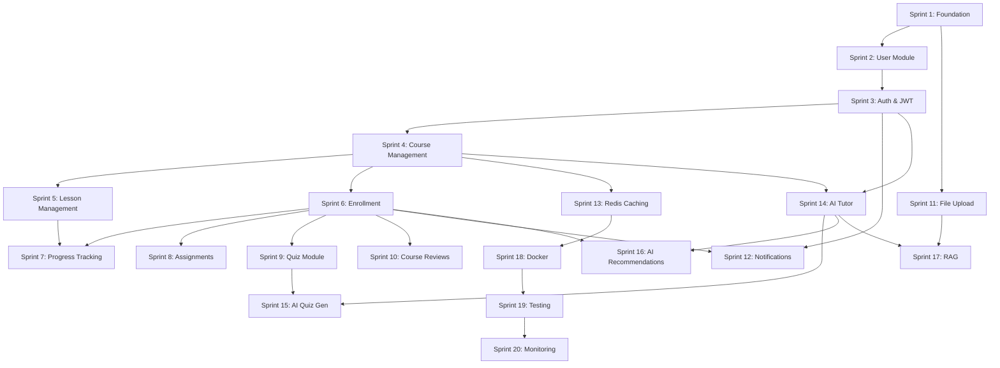

# AI-Powered LMS — Project Roadmap

> **Total Sprints**: 20 | **Estimated Duration**: ~126 working days | **Methodology**: Sprint-based iterative delivery
>
> Each sprint produces a deployable increment. Sprints are ordered by dependency — no sprint depends on a future sprint.

---

## Sprint Summary

| Sprint | Name | Days | Cumulative | Dependencies |
|--------|------|------|------------|-------------|
| 1 | Project Foundation | 5 | 5 | — |
| 2 | User Module | 5 | 10 | Sprint 1 |
| 3 | Authentication & Authorization | 7 | 17 | Sprint 2 |
| 4 | Course Management | 7 | 24 | Sprint 3 |
| 5 | Lesson Management | 5 | 29 | Sprint 4 |
| 6 | Enrollment | 5 | 34 | Sprint 4 |
| 7 | Progress Tracking | 5 | 39 | Sprint 5, 6 |
| 8 | Assignments | 7 | 46 | Sprint 6 |
| 9 | Quiz Module | 10 | 56 | Sprint 6 |
| 10 | Course Reviews | 3 | 59 | Sprint 6 |
| 11 | File Upload | 5 | 64 | Sprint 1 |
| 12 | Notifications & WebSocket | 7 | 71 | Sprint 3, 6 |
| 13 | Redis Caching | 5 | 76 | Sprint 4 |
| 14 | AI Tutor | 10 | 86 | Sprint 3, 4 |
| 15 | AI Quiz Generation | 5 | 91 | Sprint 9, 14 |
| 16 | AI Course Recommendations | 5 | 96 | Sprint 6, 14 |
| 17 | RAG — Chat with Documents | 10 | 106 | Sprint 11, 14 |
| 18 | Docker & Deployment | 5 | 111 | Sprint 13 |
| 19 | Comprehensive Testing | 10 | 121 | All previous |
| 20 | Monitoring & Production Hardening | 5 | 126 | Sprint 18, 19 |

---

## Dependency Graph

---

## Sprint 1: Project Foundation

| Field | Detail |
|-------|--------|
| **Duration** | 5 days |
| **Dependencies** | None |
| **Business Goal** | Establish the project skeleton with build system, configuration, common infrastructure, and dev tooling |

### Features
- Maven project with Spring Boot 3.3.x, Java 21, all dependencies
- Application entry point (`LmsApplication`)
- `application.yml`, `application-dev.yml`, `application-prod.yml`
- `logback-spring.xml` — profile-aware logging
- `BaseEntity` — `@MappedSuperclass` with UUID, audit fields
- `ApiResponse<T>` — generic response wrapper
- `PagedResponse<T>` — pagination wrapper
- `AppConstants` — API prefix, pagination defaults
- JPA Auditing configuration
- OpenAPI / Swagger configuration
- CORS configuration
- Global Exception Handler with custom exceptions

### Database Changes
None — no domain entities yet.

### Key Classes

| Package | Class | Purpose |
|---------|-------|---------|
| `com.abhinav.lms` | `LmsApplication` | Entry point |
| `common.entity` | `BaseEntity` | UUID + audit fields |
| `common.dto` | `ApiResponse`, `PagedResponse` | Response wrappers |
| `common.constants` | `AppConstants` | Global constants |
| `config` | `JpaConfig` | JPA auditing |
| `config` | `OpenApiConfig` | Swagger |
| `config` | `WebConfig` | CORS |
| `exception` | `GlobalExceptionHandler` | Centralized error handling |
| `exception` | `ResourceNotFoundException` | 404 |
| `exception` | `DuplicateResourceException` | 409 |
| `exception` | `BadRequestException` | 400 |
| `exception` | `BusinessException` | 422 |

### Acceptance Criteria
- [x] Application starts on port 8080
- [x] Swagger UI loads at `/swagger-ui.html`
- [x] Health endpoint returns UP

---

## Sprint 2: User Module

| Field | Detail |
|-------|--------|
| **Duration** | 5 days |
| **Dependencies** | Sprint 1 |
| **Business Goal** | Complete user management with CRUD operations — the foundational entity for all modules |

### Features
- User entity with profile fields, role, and status flags
- UserRole enum: `STUDENT`, `INSTRUCTOR`, `ADMIN`
- Validated request DTOs, response DTOs
- MapStruct mapper with create + update mapping
- Repository with email lookup, search, role-based queries
- Service interface + implementation with full CRUD
- REST controller with pagination, search, and filter endpoints

### Database Changes
- `users` table — firstName, lastName, email (unique), password, role, profileImageUrl, bio, phoneNumber, enabled, emailVerified

### API Endpoints

| Method | Endpoint | Description |
|--------|----------|-------------|
| POST | `/api/v1/users` | Create user |
| GET | `/api/v1/users/{id}` | Get user by ID |
| GET | `/api/v1/users/email/{email}` | Get user by email |
| GET | `/api/v1/users` | List users (paginated) |
| GET | `/api/v1/users/role/{role}` | Filter by role |
| GET | `/api/v1/users/search?keyword=` | Search users |
| PUT | `/api/v1/users/{id}` | Update user |
| DELETE | `/api/v1/users/{id}` | Delete user |

### Acceptance Criteria
- [x] All CRUD operations work
- [x] Validation errors return structured `ApiResponse`
- [x] Duplicate email returns 409 Conflict
- [x] Not found returns 404

---

## Sprint 3: Authentication & Authorization

| Field | Detail |
|-------|--------|
| **Duration** | 7 days |
| **Dependencies** | Sprint 2 |
| **Business Goal** | Secure the application with JWT-based authentication and role-based access control |

### Features
- Spring Security configuration (stateless, JWT filter chain)
- JWT token provider (generate, validate, extract claims)
- JWT authentication filter
- `CustomUserDetailsService`
- Login endpoint (email + password → JWT)
- Signup endpoint (register with BCrypt hashed password)
- Refresh token support
- Role-based method security (`@PreAuthorize`)
- SecurityContext integration for JPA auditing (`createdBy`/`updatedBy`)

### Database Changes
- `refresh_tokens` table or token fields on `users`

### API Endpoints

| Method | Endpoint | Description |
|--------|----------|-------------|
| POST | `/api/v1/auth/signup` | Register |
| POST | `/api/v1/auth/login` | Authenticate → JWT |
| POST | `/api/v1/auth/refresh` | Refresh access token |
| GET | `/api/v1/auth/me` | Current user profile |

---

## Sprint 4: Course Management

| Field | Detail |
|-------|--------|
| **Duration** | 7 days |
| **Dependencies** | Sprint 3 |
| **Business Goal** | Enable instructors to create and manage courses with categories and sections |

### Features
- Category entity (name, slug, parent for hierarchy)
- Course entity (title, description, price, difficulty, status, instructor→User, category→Category)
- Section entity (title, sortOrder, course→Course)
- Full CRUD for Category, Course, Section
- Course search/filter (category, difficulty, instructor, keyword)
- Instructor-only course editing

### Database Changes
- `categories`, `courses`, `sections` tables

---

## Sprint 5: Lesson Management

| Field | Detail |
|-------|--------|
| **Duration** | 5 days |
| **Dependencies** | Sprint 4 |
| **Business Goal** | Enable instructors to add lessons within course sections |

### Features
- Lesson entity (title, content, videoUrl, duration, sortOrder, contentType, section→Section)
- ContentType enum: VIDEO, TEXT, PDF, MIXED
- Lesson CRUD within sections, reordering

---

## Sprint 6: Enrollment

| Field | Detail |
|-------|--------|
| **Duration** | 5 days |
| **Dependencies** | Sprint 4 |
| **Business Goal** | Allow students to enroll in courses |

### Features
- Enrollment entity (student→User, course→Course, status, progress)
- EnrollmentStatus enum: ACTIVE, COMPLETED, DROPPED, EXPIRED
- Enroll/drop, enrollment queries, duplicate prevention

---

## Sprint 7: Progress Tracking

| Field | Detail |
|-------|--------|
| **Duration** | 5 days |
| **Dependencies** | Sprint 5, 6 |
| **Business Goal** | Track lesson completion and compute course progress |

### Features
- LessonProgress entity (enrollment→Enrollment, lesson→Lesson, completed)
- Mark complete/incomplete, course completion %, auto-complete enrollment at 100%

---

## Sprint 8: Assignments

| Field | Detail |
|-------|--------|
| **Duration** | 7 days |
| **Dependencies** | Sprint 6 |
| **Business Goal** | Assignment submission and grading workflow |

### Features
- Assignment entity (title, instructions, maxScore, dueDate, course→Course)
- AssignmentSubmission entity (assignment, student, content, grade, feedback)
- Submit, grade, late detection

---

## Sprint 9: Quiz Module

| Field | Detail |
|-------|--------|
| **Duration** | 10 days |
| **Dependencies** | Sprint 6 |
| **Business Goal** | Full quiz system with multiple question types and auto-grading |

### Features
- Quiz, QuizQuestion, QuizAttempt, QuizAnswer entities
- QuestionType: SINGLE_CHOICE, MULTIPLE_CHOICE, TRUE_FALSE, SHORT_ANSWER
- Create quizzes, take attempts, auto-grade, view results
- Attempt limits, timer enforcement

---

## Sprint 10: Course Reviews

| Field | Detail |
|-------|--------|
| **Duration** | 3 days |
| **Dependencies** | Sprint 6 |
| **Business Goal** | Course ratings and reviews by enrolled students |

### Features
- Review entity (course, student, rating 1-5, comment)
- One review per student per course, average rating calculation

---

## Sprint 11: File Upload

| Field | Detail |
|-------|--------|
| **Duration** | 5 days |
| **Dependencies** | Sprint 1 |
| **Business Goal** | File upload for profiles, course thumbnails, and assignment submissions |

### Features
- StorageService interface + LocalStorageService
- Upload/download endpoints, type/size validation

---

## Sprint 12: Notifications & WebSocket

| Field | Detail |
|-------|--------|
| **Duration** | 7 days |
| **Dependencies** | Sprint 3, 6 |
| **Business Goal** | Real-time notification system |

### Features
- Notification entity with types (ENROLLMENT, GRADE, COURSE_UPDATE, etc.)
- WebSocket (STOMP) for real-time push
- REST endpoints for history, mark read, unread count

---

## Sprint 13: Redis Caching

| Field | Detail |
|-------|--------|
| **Duration** | 5 days |
| **Dependencies** | Sprint 4 |
| **Business Goal** | Cache frequently accessed data |

### Features
- Redis config, @Cacheable/@CacheEvict on courses, users, categories
- Graceful degradation on Redis failure

---

## Sprint 14: AI Tutor

| Field | Detail |
|-------|--------|
| **Duration** | 10 days |
| **Dependencies** | Sprint 3, 4 |
| **Business Goal** | AI-powered tutoring chatbot |

### Features
- Spring AI integration (OpenAI/Gemini)
- AiChatSession + AiChatMessage entities
- Contextual tutoring, streaming responses (SSE), token tracking

---

## Sprint 15: AI Quiz Generation

| Field | Detail |
|-------|--------|
| **Duration** | 5 days |
| **Dependencies** | Sprint 9, 14 |
| **Business Goal** | Auto-generate quizzes from lesson content using AI |

---

## Sprint 16: AI Course Recommendations

| Field | Detail |
|-------|--------|
| **Duration** | 5 days |
| **Dependencies** | Sprint 6, 14 |
| **Business Goal** | Personalized course suggestions based on enrollment history |

---

## Sprint 17: RAG — Chat with Documents

| Field | Detail |
|-------|--------|
| **Duration** | 10 days |
| **Dependencies** | Sprint 11, 14 |
| **Business Goal** | Answer questions from uploaded documents using RAG pipeline |

### Features
- Document upload, text extraction, chunking
- Vector embeddings (PGVector), similarity search
- RAG pipeline with source attribution

---

## Sprint 18: Docker & Deployment

| Field | Detail |
|-------|--------|
| **Duration** | 5 days |
| **Dependencies** | Sprint 13 |
| **Business Goal** | Containerize for consistent deployment |

### Features
- Multi-stage Dockerfile, docker-compose (app + PostgreSQL + Redis)
- Environment variable config, health checks, volumes

---

## Sprint 19: Comprehensive Testing

| Field | Detail |
|-------|--------|
| **Duration** | 10 days |
| **Dependencies** | All previous |
| **Business Goal** | Production-level test coverage |

### Features
- Unit tests (all services), integration tests (Testcontainers)
- Controller tests (MockMvc), repository tests (@DataJpaTest)
- Target: 80%+ coverage on service + controller layers

---

## Sprint 20: Monitoring & Production Hardening

| Field | Detail |
|-------|--------|
| **Duration** | 5 days |
| **Dependencies** | Sprint 18, 19 |
| **Business Goal** | Production-ready observability and schema management |

### Features
- Actuator endpoints, custom health indicators
- Structured JSON logging, Micrometer metrics
- Flyway migration scripts, API documentation polish, README

---

*End of Roadmap*
